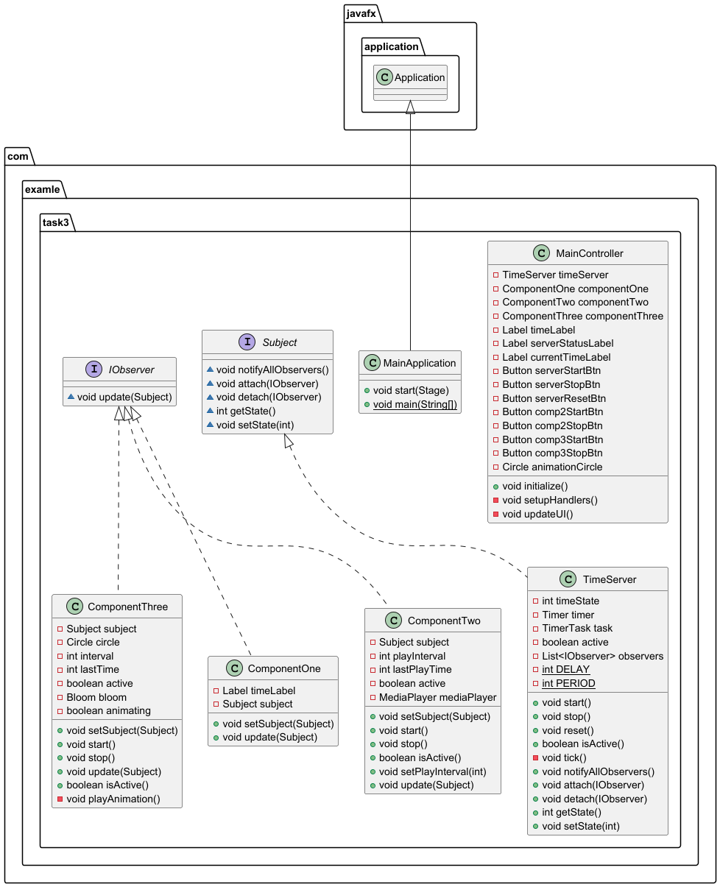

## Описание  
Time — это JavaFX-приложение, реализующее единый центральный сервер времени. Раз в секунду сервер увеличивает глобальный целочисленный тик и автоматически оповещает все подключённые компоненты через шаблон проектирования Observer. Пользовательский интерфейс позволяет в реальном времени запускать секундомер, настраивать обратный отсчёт таймера (с указанием числа тиков) и устанавливать будильник на конкретное значение глобального тика. Каждая функция визуально отображает своё текущее состояние — идёт отсчёт, остановлен ли секундомер, сработал ли будильник или таймер достиг нуля. Проект наглядно демонстрирует практическую реализацию событийно-ориентированной модели на JavaFX, а также корректное потокобезопасное обновление пользовательского интерфейса из фонового потока.

---

## Основные возможности  
- Генерация глобального тика раз в секунду и его непрерывное отображение в текстовом поле интерфейса  
- Секундомер с полноценными функциями старта, остановки и сброса, который отсчитывает время, будучи строго привязанным к системному потоку глобальных тиков  
- Таймер обратного отсчёта на заданное пользователем количество тиков с автоматической остановкой при достижении нуля и текстовой подсказкой «ГОТОВО» в интерфейсе  
- Будильник, активируемый при совпадении текущего глобального тика с заданным пользователем значением, включающий проверку невозможных значений (например, уже пройденные тики) и визуальную индикацию срабатывания  
- Полностью независимое управление каждой функцией (секундомер, таймер, будильник) сверх единого источника времени — все компоненты могут быть запущены, остановлены или сброшены по отдельности  
- Безопасное обновление интерфейса из любого фонового потока с использованием `Platform.runLater`, что полностью исключает состояния гонки данных и некорректное отображение информации на экране  

---

## Архитектура  
- Пакет `com.example.timeserver`:  
  - `TimeServer` реализует интерфейс `Subject`, создаёт внутри себя фоновый `Timer` (или `ScheduledExecutorService`) и каждую секунду уведомляет всех зарегистрированных наблюдателей о новом глобальном тике  
  - Интерфейсы `Subject` и `IObserver` задают строгий контракт паттерна Observer для всех подключаемых к серверу компонентов  
  - `StopwatchComponent`, `TimerComponent`, `AlarmComponent` реализуют `IObserver` и содержат всю внутреннюю бизнес-логику соответственно для секундомера, таймера обратного отсчёта и будильника  
- Контроллер `HelloController`:  
  - Отвечает за создание экземпляров всех трёх компонентов, подписку их на сервер времени, обработку пользовательского ввода (текстовые поля для тиков таймера и будильника) и валидацию введённых значений с выводом сообщений об ошибках  
  - Управляет элементами интерфейса типа `Label` и `TextField`, обрабатывает нажатия кнопок (старт/стоп/сброс), а также связывает состояние компонентов с их визуальным отображением  
- `HelloApplication`:  
  - Главная точка входа в приложение — загружает FXML-файл `hello-view.fxml`, создаёт и настраивает сцену JavaFX, инициализирует и запускает основной цикл приложения  
- FXML (`hello-view.fxml`):  
  - Описывает вертикально организованный пользовательский интерфейс с четырьмя логическими блоками: блок глобального тика, блок секундомера, блок таймера и блок будильника. Каждый блок содержит соответствующие кнопки управления (Старт, Стоп, Сброс), поля для ввода значений и метки для отображения текущего состояния

## UML-диаграмма проекта

